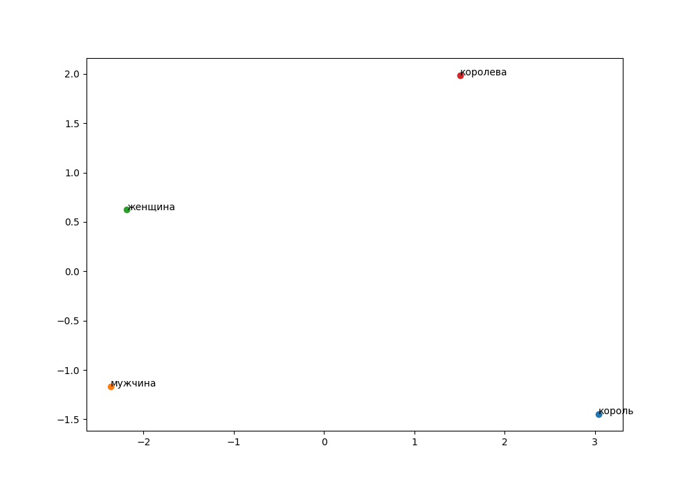

# Word2vec
## Данные: датасет qa_wiki_ru https://huggingface.co/datasets/AIR-Bench/qa_wiki_ru
### Задание
#### Подготовка данных:
• Соберите или найдите объемный текстовый корпус (например,
коллекции статей, книг или доменно-специфических текстов).
  
• Выполните предобработку текста (токенизация, приведение к нижнему
регистру, удаление пунктуации и стоп-слов при необходимости).  
##### Package textEdit.\_\_init__.py при помощи библиотеки nltk предобрабатывает датасет и сохраняет [preprocessed_large_file.csv](textEdit/preprocessed_large_file.csv).  
#### Обучение модели:
• С помощью библиотеки “gensim” обучите модели Word2Vec используя
архитектуры CBOW и Skip-gram на вашем корпусе.  

• Поэкспериментируйте с различными гиперпараметрами (размер
эмбеддинга, размер окна, минимальная частота и т. д.).  
  
Произведено обучение с гиперпараметрами sg = [0, 1], window = [2, 5, 10], vector_size = [50, 100], где sg отвечает за использование
CBOW SkipGram, window - размер окна, vector_size - размер эмбеддинга.  
Сохранено 12 моделей и протестированы на различных тестовых данных.  
Результат в [Лог](mostSimilar/output.txt)
  

  
##### Обучение происходит в Package fitModel.\_\_init__.py с различными гиперпараметрами такими как window, vector_size, sg(0-CBOW,1-SkipGram) и сохраняет модели в файлы. 

#### Анализ:
• Визуализируйте эмбеддинги слов с помощью методов PCA или t-SNE.
• Найдите наиболее похожие слова для заданного списка слов и
интерпретируйте результаты.
• Выполните задачи на аналогии слов (например, "король" - "мужчина" +
"женщина" ≈ ?).  
  [Лог](mostSimilar/output.txt)  
  
Визуализация эмбедингов(На лучшем наборе гиперпараметров)
### CBOW  

  

### SkipGram  

 

### Резултаты работы модели(с параметрами 5 - размер окна, 100 - размер эмбединга)  
  
#### СBOW  
  
'король' - 'мужчина' + 'женщина' ≈ [('королева', 0.7289323210716248), ('принцесса', 0.6244730353355408), ('правительница', 0.6109467148780823), ('императрица', 0.6029678583145142), ('британия', 0.5991037487983704), ('изабелла', 0.5967390537261963), ('короля', 0.5963394045829773), ('армия', 0.5807015299797058), ('герцогиня', 0.5756858587265015), ('корона', 0.569511890411377)]  
'утро' - 'день' + 'ночь' ≈ [('полночь', 0.596179723739624), ('приключение', 0.5914931893348694), ('тишина', 0.5848371982574463), ('умираю', 0.5803104043006897), ('метель', 0.5726402997970581), ('зарево', 0.5708838105201721), ('свидание', 0.5645644068717957), ('рассветом', 0.5582988858222961), ('безмолвие', 0.5581774115562439), ('тумане', 0.5541046261787415)]  
'книга' - 'читать' + 'писать' ≈ [('публикация', 0.735307514667511), ('трилогия', 0.6912176609039307), ('проза', 0.6853872537612915), ('повесть', 0.6818001866340637), ('брошюра', 0.6720760464668274), ('автобиография', 0.6515461802482605), ('книжечка', 0.6457613110542297), ('тетрадь', 0.6412061452865601), ('книгу', 0.6348724365234375), ('поэзия', 0.621370792388916)]  
  
#### SkipGram
  
'король' - 'мужчина' + 'женщина' ≈ [('королева', 0.845669150352478), ('короля', 0.7533308267593384), ('лангобардская', 0.7406015992164612), ('пхумипон', 0.7375263571739197), ('регентша', 0.7373798489570618), ('королеваконсорт', 0.7357816100120544), ('королём', 0.7356029152870178), ('кастильская', 0.7300951480865479), ('фредегонда', 0.7277196049690247), ('аквитанская', 0.7261840105056763)]  
'утро' - 'день' + 'ночь' ≈ [('ночи', 0.7226781845092773), ('безмолвная', 0.7071771025657654), ('тумане', 0.704570472240448), ('хмурое', 0.6955432891845703), ('буря', 0.6930575966835022), ('темна', 0.6901399493217468), ('рассвете', 0.6867372989654541), ('плывём', 0.6854215860366821), ('разбитое', 0.6846027970314026), ('полночь', 0.6826133131980896)]  
'книга' - 'читать' + 'писать' ≈ [('повесть', 0.7967744469642639), ('автобиографическая', 0.7944642901420593), ('документальная', 0.7880185842514038), ('проза', 0.7723284959793091), ('очерков', 0.7668272852897644), ('стихов', 0.7660056352615356), ('трилогия', 0.7610893249511719), ('рассказов', 0.7594026327133179), ('книги', 0.7514280080795288), ('двухтомник', 0.7492163777351379)]  
Наиболее похожие слова для 'король':
